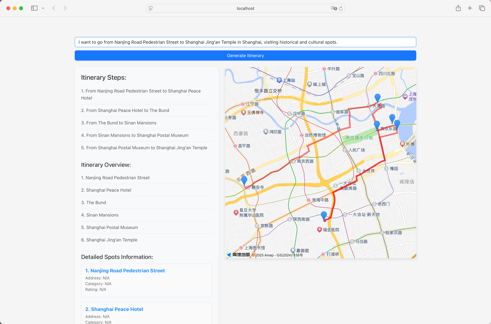

# JourneyAI

## 项目概述
JourneyAI 是一个基于人工智能的旅行规划工具，通过先进的语言模型为用户提供个性化的旅行推荐和行程规划，针对用户偏好（如预算、旅行风格、兴趣）生成高质量建议。



## 功能特性
- **个性化推荐**：根据用户输入（如预算、兴趣、旅行目的地）生成定制化行程。
- **高效交互**：提供精准、快速的旅行建议。
- **多平台支持**：支持 USA 和加拿大旅行政策查询，计划扩展至更多地区。

## 技术栈
- **核心框架**：LangChain
- **编程语言**：Python
- **前端**：React（Node.js）
- **依赖管理**：pip（requirements.txt）、npm

## 安装与使用
1. 克隆仓库：
   ```bash
   git clone https://github.com/ra1dsevn/JourneyAI.git
   cd JourneyAI
2. 安装后端依赖：
    pip install -r requirements.txt
    cd itinera-frontend
    npm install
    cd ..
    python main.py
    cd itinera-frontend
    npm start
3.  访问前端
    打开浏览器，进入 http://localhost:3000。
4.  输入旅行相关查询（如“为预算 $1000 的家庭设计 3 天纽约行程”）。
   
